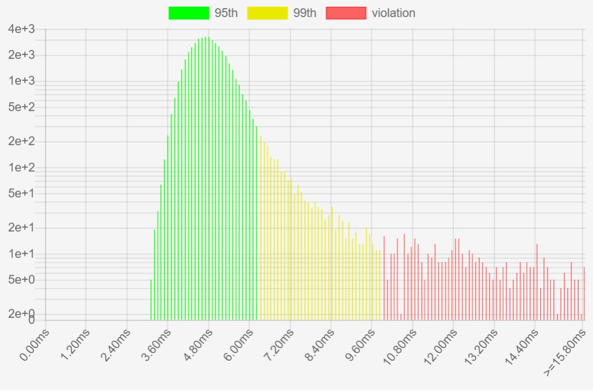
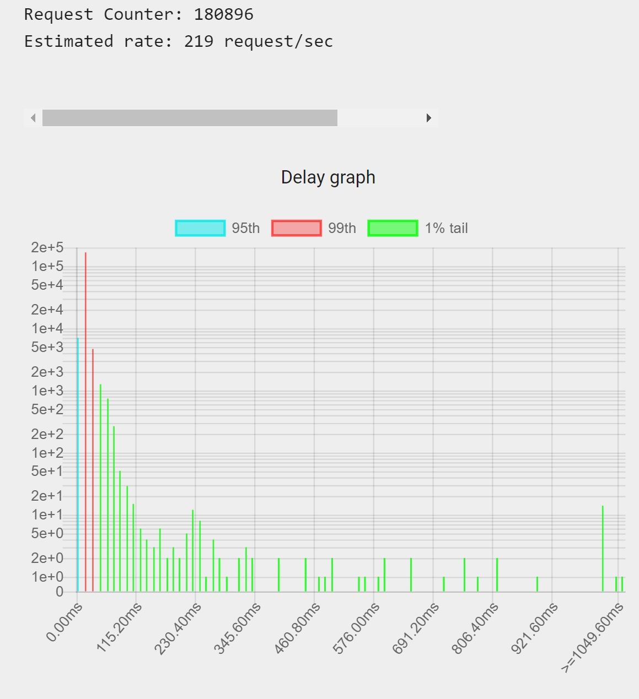

# REST-based Twitter service
### Kyeongsoo Kim, Feb 2018 ~ Present

# Introduction
 REST-based Twitter service and API using `NodeJS`, `Cassandra`,`MongoDB`, `memcached`, `ExpressJS`, `handlebarsJS`.

# IP QOS (Quality Of Service)

 - using one machine

- QOS in Distributed System (at least 4 machines) with NGINX, MongoDB Cluster

> Code for multiple machine version is [here](https://github.com/samleung314/TwitterClone/graphs/contributors)

# Database Setup
`Cassandra`
- Install Cassandra 2.2(22x)
- Create “db” keyspace (replication factor 1 with Simple Strategy)
- Create a table “media” that includes a id (text) and content (blob) columns
- use localhost

`MongoDB`
- use localhost

`Memcached`
- use localhost

# REST API

- There are 16 route endpoints
- POST parameters are JSON (application/json)

### /adduser
 <pre>
Method : POST
Request Params {username, email, password}

Register new user account, Username and email must be unique.
user will get email with verification key, verification is need for the future use.

Returns:
    status: “OK” or “error”
    error: error message (if error)

</pre>

### /login
<pre>
Method : POST
Request Params {username, password}
Login to account
Sets session cookie

Returns:
    status: “OK” or “error”
    error: error message (if error)
</pre>

### /logout
<pre>
Method : POST
Logout of account

Returns:
    status: “OK” or “error”
    error: error message (if error)
</pre>

### /verify
<pre>
Method : POST
Request Params
    - email
    - key

Verifies account
Master key : avadacadabra

Returns:
    status: “OK” or “error”
    error: error message (if error)
</pre>

### /additem
<pre>
Method : POST
Request Params
    - content
    - childType: string("retweet or "reply"), null if not a child item.
        - Optional

Post a new item
Only allowed if logged in

Returns
    status: “OK” or “error”
    id: unique item ID (if OK) (ID is type String)
    error: error message (if error)

</pre>

### /item/<id>
<pre>
Method : GET

Get contents of a single item given an ID

Returns
    status: “OK” or “error”
    item: {
        id: item id (ID is type String)
        username: username who sent item
    property: {
        likes: number
    }
    retweeted: number
    content: body of item, (original content if this item is a retweet)
    timestamp: timestamp, represented as Unix time
    }
    error: error message (if error)

</pre>

### /search
<pre>
Method : POST
Request Params
    - timestamp: search items from this time and earlier
        - Represented as Unix time in seconds
        - Integer, optional
        - Default: Current time
    - limit: number of items to return
        - Integer, optional
        - Default: 25
        - Max: 100

Gets a list of the latest <limit> number of items prior to (and including) the provided <timestamp>

Returns
    status: “OK” or “error”
    items: Array of item objects (see /item/:id)
    error: error message (if error)

</pre>

### /item/< id >/like
<pre>
Method : POST
Request Params
    - like:
        - Boolean
        - Default: true
    
Likes or unlikes a item ID

Returns
    status: “OK” or “error”
</pre>

### /addmedia
<pre>
Method : POST
Request Params
    - content: binary content of file being uploaded
        - Type is multipart/form-data

Adds a media file (photo or video)

Returns
    status: “OK” or “error”
    id: ID of uploaded media
    error: error message (if error)
</pre>

### /media/<id>
<pre>
Method : GET

Gets media file by ID
Returns media file (image or video)
</pre>